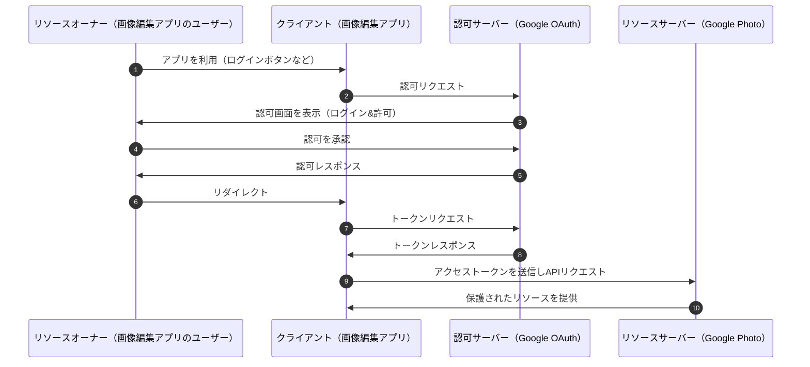
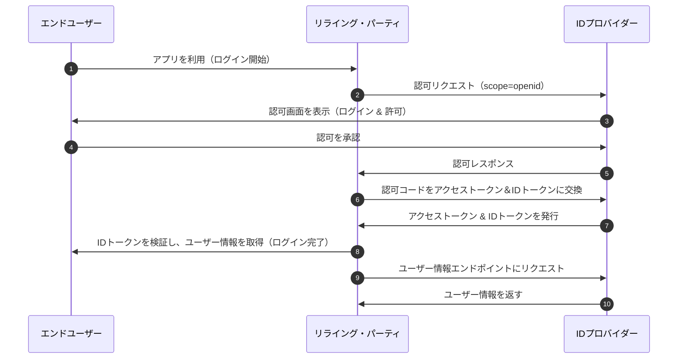

# ログイン機能を実装してみよう
## 課題1
### 認証（Authentication）
ユーザーが「誰であるか」を確認するプロセスを指す。一般的に、ユーザーIDとパスワードの入力、OAuth、指紋認証などの手段が用いられる。認証が成功すると、アプリケーションはそのユーザーが正規の利用者であることを確認できる。  

### 認可（Authorization）
認証済みのユーザーが「何をできるか」を決定するプロセスを指す。例えば、管理者のみが特定のページにアクセスできるようにする、一般ユーザーには閲覧のみ許可し編集は制限する、といった権限の管理が該当する。認可の仕組みとしては、ロールベースアクセス制御（RBAC）やポリシーベースアクセス制御（PBAC）などが代表的。

### OAuth2.0を認証の仕組みと呼んではいけない理由
OAuth2.0は「認可」のフレームワークであり、厳密には「認証」の仕組みではない。  
OAuth2.0の主な目的は、クライアントがリソースサーバーへアクセスする際に、ユーザーの資格情報（例: ID・パスワード）を直接扱わず、安全にアクセストークンを取得し、そのトークンを用いて権限を付与することである。このため、OAuth2.0は「特定のリソースに対するアクセス権限を委譲する仕組み」と言える。  
一方で、「認証」は「ユーザーが誰であるか」を確認するプロセスを指す。OAuth2.0自体にはユーザーの識別を保証する機能は含まれていない。

### OAuth2.0

**リソースオーナー（Resource Owner）**

保護されたリソース（例: ユーザーデータ）を所有するエンドユーザー。
クライアントに対してアクセス権を付与する。

**クライアント（Client）**

リソースオーナーの代わりにリソースにアクセスしたいアプリケーション。
認可サーバーからアクセストークンを取得し、リソースサーバーへリクエストを送る。

**認可サーバー（Authorization Server）**

リソースオーナーの認可を確認し、クライアントにアクセストークンを発行するサーバー。

**リソースサーバー（Resource Server）**

保護されたリソースを管理するサーバー。
クライアントからのリクエストを受け付け、アクセストークンの検証を行い、認可されたリソースを提供する。


### 認可コードグラント


**1:**

ブラウザは認可リクエストのリンクを作成して、ブラウザに表示する。

**2:**

ブラウザに表示されたリンクをユーザーがクリックすると、認可リクエストが認可サーバーに送信される。

認可リクエストのパラメータ
- scope: どのデータに対して、どのような操作を許可して欲しいかを指定する。
- response_type: 認可レスポンスで受け取るデータ。この指定によって、フローの種類が変わる。
- response_mode: 認可レスポンスでのデータの受け取り方。"query"か"fragment"が選べる。
- client_id: 認可サーバーが管理するクライアントのID
- redirect_uri: 認証・認可後のリダイレクト先のURL（リダイレクションエンドポイントのURL）
- state: 認証・認可後のリダイレクト先のURLに含めてもらうランダムな値。リダイレクションエンドポイントへのCSRFを防ぐ用途で用いる。
- nonce: IDトークンに含めてもらうランダムな値。IDトークンの正当性をチェックする用途で用いる。

リクエスト例

```http
https://server.example.com/authorize?response_type=code
  &response_mode=fragment
  &scope=profile email
  &client_id=myapp
  &redirect_uri=https://client.example.org/app.html
  &state=af0ifjsldkj
  &nonce=n-0S6_WzA2Mj
```


**3:**

認証と認可の画面が表示される。

**4:**

ユーザーは許可する内容を確認し、許可を承認。

**5:**

認可サーバーは認可コードを生成して、認可レスポンスを返す。認可レスポンスはクライアントへのリダイレクトレスポンスである。

認可レスポンスのパラメータ
- code: 認可サーバーが発行した認可コード
- state: 認可リクエストで指定したstateの値

```http
HTTP/1.1 302 Found
Location: https://client.example.org/app.html#
  code=SplxlOBeZQQYbYS6WxSbIA
  &state=af0ifjsldkj
```

**6:**

クライアントのリダイレクションエンドポイントにリダイレクトする。この時にパラメーターに認可コードが含まれる。
クライアントはリクエストの中に含まれている認可コードを取り出して、認可サーバーのトークンエンドポイントにリクエストする。

クライアントのリダイレクションエンドポイントへのリクエスト例

```http
GET  /app.html
HOST: client.example.org
```

**7:**

Clientはリクエストの中に含まれている認可コードを取り出して、認可サーバーのトークンエンドポイントにリクエストする。

トークンリクエストのパラメータ
- grant_type: トークンを発行する手段。認可コードで取得する場合は`authorization_code`を指定
- code: 認可コード
- client_id: ClientのID
- redirect_uri: Clientのリダイレクションエンドポイント。認可リクエストの時に指定したものと同じ値を指定。

```http
POST /token HTTP/1.1
Host: server.example.com
Content-Type: application/x-www-form-urlencoded
grant_type=authorization_code
&code=SplxlOBeZQQYbYS6WxSbIA
&client_id=myapp
&redirect_uri=https://client.example.org/app.html
```


**8:**

認可サーバーがトークンレスポンスを返す。

トークンリクエストの主なメンバ
- id_token: IDトークン
- access_token: アクセストークン
- refresh_token: リフレッシュトークン
- token_type: リソースサーバーにアクセストークンを送信するときの手段。通常はBearerが設定される
- expires_in: アクセストークンの有効期間の秒数

```http
HTTP/1.1 200 OK
Content-Type: application/json
Cache-Control: no-store
Pragma: no-cache

{
    "access_token": "SlAV32hkKG",
    "token_type": "Bearer",
    "refresh_token": "8xLOxBtZp8",
    "expires_in": 3600,
    "id_token": "eyJhbGciOiJSUzI1NiIsImtpZCI6Ij........"
}
```

**9, 10:**

アクセストークンをリクエストヘッダにセットして、リソースサーバーにリクエストし保護されたリソースの情報を返す。

### アクセストークン
OAuth2.0においてリソースサーバーへのアクセス権を表すトークンであり、クライアントがAPIを利用する際に認可情報として送信する。通常、短期間で有効期限が切れる。形式はBearer Tokenが一般的で、HTTPヘッダーに含めて送信される。アクセストークンの発行や検証は認可サーバーが行い、不正利用を防ぐためにscopeを指定し、アクセス可能な範囲を制限できる。

### リフレッシュトークン
OAuth2.0においてアクセストークンの有効期限が切れた際に、新しいアクセストークンを取得するためのトークンである。認可サーバーからアクセストークンと共に発行され、通常は長期間有効だが、サーバー側で失効させることも可能。リフレッシュトークンを用いることで、ユーザーの再認証なしにアクセストークンを更新でき、利便性とセキュリティのバランスを保つ。リフレッシュトークン自体を安全に管理することが重要であり、漏洩すると不正アクセスのリスクがある。

### 認可コード
OAuth2.0の認可コードグラントにおいて、クライアントがアクセストークンを取得するために使用する一時的なコードである。ユーザーが認可サーバーで認可を行うと、リダイレクトURIを通じてクライアントに付与される。クライアントはこのコードを認可サーバーに送信し、アクセストークンと交換する。認可コードは短時間のみ有効で、直接アクセストークンを発行せずにコードを介することで、セキュリティを強化し、アクセストークンの漏洩リスクを低減できる。

### 認可エンドポイント
OAuth2.0においてクライアントがユーザーに認可を求めるためのURLである。ユーザーがこのエンドポイントにアクセスすると、認可サーバーはユーザーに対してリソースへのアクセス許可を求める認証画面を表示する。ユーザーが認可すると、認可サーバーは認可コードやアクセストークンをクライアントに返却する。認可エンドポイントは、クライアントID、リダイレクトURI、要求されるスコープなどのパラメータを受け取り、認可のフローを開始する役割を果たす。

### トークンエンドポイント
OAuth2.0においてクライアントがアクセストークンを取得するためにリクエストを送るURLである。アクセストークンの取得には認可コードフローやリフレッシュトークンフローなどが使用され、クライアントはトークンエンドポイントに対して必要なパラメータ（認可コード、クライアントID、クライアントシークレット、リフレッシュトークンなど）を送信する。認可サーバーはリクエストを検証し、成功するとアクセストークンをクライアントに返却する。

### リダイレクトエンドポイント
OAuth2.0において認可サーバーが認可コードやアクセストークンをクライアントに返すために使用するURLである。ユーザーが認可サーバーで認証・認可を行った後、認可サーバーはクライアントに対してリダイレクトエンドポイントにリダイレクトし、認可コードやエラーコードを含めたリクエストを送信する。クライアントはこのエンドポイントで受け取った認可コードを使って、トークンエンドポイントにリクエストを送ることでアクセストークンを取得する。

### OIDC



OAuth2.0と似ているが、以下の点がOIDC特有である。

**2:**

認可リクエストのパラメータscopeに`openid`を含める。

```http
https://server.example.com/authorize?response_type=code
  &response_mode=fragment
  &scope=openid profile email
  &client_id=myapp
  &redirect_uri=https://client.example.org/app.html
  &state=af0ifjsldkj
  &nonce=n-0S6_WzA2Mj
```

**8:**

クライアントは取得した IDトークンをデコードし、署名を検証することで、ユーザーのログインを確定する。

```json
{
  "iss": "https://authorization-server.com",
  "sub": "1234567890",
  "aud": "CLIENT_ID",
  "exp": 1618888888,
  "iat": 1618885288,
  "nonce": "RANDOM_STRING",
  "email": "user@example.com",
  "name": "Taro Yamada"
}
```

### IDトークン
**1. 誰がなんのために発行し、どのように利用されるのか**

**発行者:**

OIDCにおける認可サーバーによって発行される。OAuth2.0のアクセストークンと異なり、IDトークンはユーザーの認証情報を証明するために使用される。

**利用目的:**

クライアントがユーザーの認証状態を確認するために利用される。クライアントはIDトークンを受け取り、ユーザーが正しく認証されたことを確認する。また、IDトークンはユーザーに関する基本的な情報を提供し、クライアントがログイン処理を完了するために使用される。

**2. どのような形式で、どんな情報が含まれているのか**

**形式:**

IDトークンは、JWT（JSON Web Token） 形式で発行され、3つの部分（ヘッダー、ペイロード、署名）で構成されている。
- ヘッダー: トークンの種類（JWT）や署名アルゴリズム（例：RS256）が含まれる。
- ペイロード: ユーザーに関する情報（sub, name, emailなど）やトークンの発行者（iss）、有効期限（exp）などのクレーム（claim）が含まれる。
- 署名: トークンの整合性を保証するための署名が含まれる。

```json
{
  "sub": "user123",
  "name": "Taro Yamada",
  "email": "taro.yamada@example.com",
  "iss": "https://authorization-server.com",
  "exp": 1633024800
}
```

**3. IDトークンによる認証は、OAuthによる認証と比べて何が優れているのか**

**認証の明確性:** 

OAuth2.0は基本的に認可に特化したプロトコルであり、アクセストークンを通じてリソースへのアクセスを許可することが目的。しかし、OAuth2.0単独ではユーザーが本当に認証されたかを示す情報が不足している。一方、OIDCのIDトークンはユーザー認証の証明を含んでおり、ユーザーが正当に認証されたかを明示的に確認可能。

**ユーザー情報の提供:**

IDトークンは認証されたユーザーに関する情報（メールアドレス、名前など）を直接含むため、クライアントが認証後にその情報をすぐに利用することができる。

**4. アクセストークンとの役割の違いはなにか**

**アクセストークンの役割:**

アクセストークンは、OAuth2.0でリソースサーバーに対してリソースへのアクセス権を提供するためのトークン。アクセストークンはユーザーのリソースに対するアクセスを許可するものであり、認証の目的では使用されない。

**IDトークンの役割:**

IDトークンはユーザーの認証情報を証明するためのトークンであり、認証の完了を確認するために使用される。IDトークンはユーザーが正当な認証を受けたことを示すものであり、アクセストークンとは異なり、リソースへのアクセス権限を与えるものではない。

### UserInfoエンドポイント

**利用タイミング**

IDトークンを受け取った後、追加のユーザー情報を取得するために使用される。特に、OIDCにおいて、ユーザー認証が完了した後にクライアントがそのユーザーに関する詳細な情報を取得したい場合に呼び出される。

**利用目的:**

認可サーバーに保存されているユーザーのプロフィール情報を取得するために使用される。IDトークンには基本的な情報が含まれているが、詳細なユーザー情報を取得するために、追加のリクエストが必要な場合がありうる。

UserInfoエンドポイントへのリクエスト例(Bearer Tokenでアクセストークンを指定)

```http
GET /userinfo HTTP/1.1
Host: server.example.com
Authorization: Bearer SlAV32hkKG
```

レスポンス例

```json
{
  "sub": "248289761001",
  "name": "Taro Yamada",
  "given_name": "Taro",
  "family_name": "Yamada",
  "preferred_username": "t.yamada",
  "email": "taro-yamada@example.com",
  "picture": "http://example.com/taroyamada/me.jpg"
}
```
