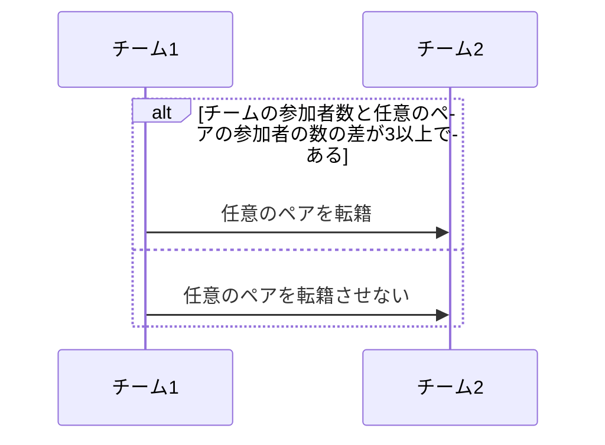

## チームに所属するペアを変更する

```mermaid
sequenceDiagram
    participant T as チーム1
    participant U as チーム2
    alt チームの参加者数と任意のペアの参加者の数の差が3以上である
        T->>U: 任意のペアを転籍
    else
        T->>U: 任意のペアを転籍させない
    end
```
