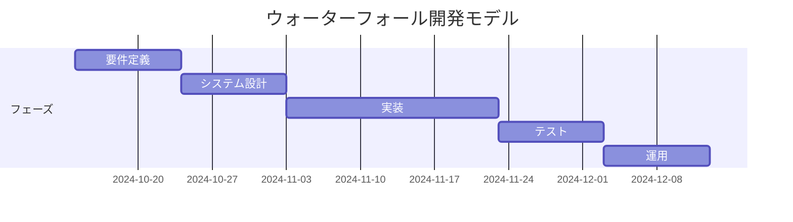
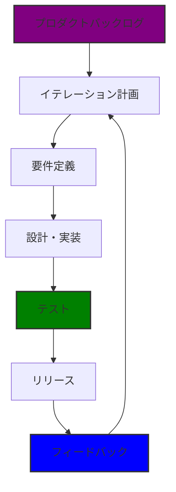

# アジャイル開発を学ぼう
## 課題1

アジャイル開発は、顧客満足を最優先にし、価値のあるソフトウェアを早く継続的に提供することに重きを置く開発手法である。

### ウォーターフォール開発

- リリースまでの期間が長期化しがち。
- 顧客からのフィードバックを得るまでや、フィードバックを反映するまでが長い。

### アジャイル開発

- 短いサイクルで最終成果物（動くソフトウェア／システム）をリリースするので、早い段階で実際に動作させて認識合わせができる。
- フィードバックを後続のイテレーションですぐに反映できる。

アジャイル開発を実践しても機能の開発スピードは上がらない。

しかし、スコープを絞り、短い期間で開発をするので、最初のリリースまでの期間が短くなる。

### ユーザーストーリー

ユーザーストーリーは、顧客がソフトウェアで実現したいと思っている機能を簡潔に記述したものである。  
顧客にとって価値があることを書く。

ユーザーストーリのテンプレート

「<誰>として、私は<何>をしたい。それは<なぜ>か。」  
例: 「ユーザーとして、私はパスワードを再設定できるようにしたい。それはアカウントに再度ログインできるようにするためだ。」

ユーザーストーリーを書く際には、`INVEST`に留意する。
- Independent
- Negotiable
- Valuable
- Estimatable
- Small
- Testable

ユーザーストーリーを具体的に書きすぎないのは、機能を思いついたばかりの時点では、それが本当に必要なものかどうかが分からないからである。
- その機能を実装するのは数ヶ月後かもしれない
- 実装する頃には、世の中の状況やソフトウェアの開発状況も変わっているはず。

  したがって、ユーザーストーリーを書いてすぐの時点では、検討する時間とエネルギーを節約しておく。

  機能の本質だけを書いておき、あとでお客さんと会話する時に何の話をするのかを思い出すために用いる。

ストーリーに時間がかかった場合、予測が外れたという結果を示すものであり、ストーリーポイント自体を調整するのは避ける。  
次のイテレーションの見積もりを改善するためのフィードバックとして利用する。  
ストーリーポイントをイテレーション中に増やしてしまうと、チームのベロシティの信頼性が損なわれる。  
ベロシティは過去の実績に基づいて計算され、次回の見積もりや計画に使われるため、見積もりはあくまで当初の予測として残し、実績との差異を学びとして捉えるべき。

### ストーリーポイント

ストーリーポイントには、「実際に開発にかかった時間」ではなく「当初見積もった時間」 を使うべきである。  
ストーリーポイントは、絶対的な時間や労力を表すものではなく、相対的な複雑さや作業量を示すための指標である。  
チームが過去の経験をもとに、そのストーリーが他のストーリーと比べてどれくらい難しいかを見積もるものであり、時間と直接結びつけるものではない。

本来のストーリーポイントの目的は、チームの作業を管理するためではなく、プロジェクト全体の予測と計画を支援するためのツールとして活用されるべきである。

**相対的な見積もりのツール**

ストーリーポイントは、エンジニアの働きぶりや生産性を測る指標ではなく、チーム全体で作業の複雑さや規模を評価するための相対的な見積もりツールである。  
チームがそれぞれのユーザーストーリーを他のストーリーと比較して「どれくらい難しいか」「どれだけの作業が必要か」を見積もるためのもの。  
これにより、チームは次のイテレーションでどれだけの作業を完了できるかを予測できるようになる。

**チームのベロシティの理解と予測**

ストーリーポイントは、チームの進捗を追跡し、次回の作業量を予測するためのツールとして使用されるべきである。  
各イテレーションでチームが完了できるストーリーポイント（ベロシティ）を追跡することで、将来のイテレーションでどれくらいの作業が可能かを予測できる。

**予測精度の向上**

ストーリーポイントは予測精度を向上させるためのフィードバックメカニズムである。  
見積もりが外れた場合、その原因を振り返り、次の見積もりでより正確にするための学習材料とする。  
これにより、チームは時間をかけて予測精度を向上させ、無理のない計画が立てられるようになる。

**コミュニケーションのツール**

ストーリーポイントは、チーム間のコミュニケーションや、プロダクトオーナーとの対話を円滑にするツールである。  
例えば、プロダクトオーナーは次のイテレーションでどのストーリーに優先順位をつけるかを判断する際、ストーリーポイントを参考にする。  
また、チームは過去の実績をもとに、プロジェクトの進行状況をステークホルダーと共有できる。

**無理のない計画のために**

本来のストーリーポイントの役割は、無理のない計画を立て、チームが持続可能なペースで作業を進められるようにすることである。  
もしストーリーポイントがエンジニアに無理を強いるために使われると、燃え尽き症候群や生産性の低下を招く可能性がある。  
XPの基本原則である「持続可能なペースでの開発」は、ストーリーポイントを適切に使うことで達成される。

### タスク

タスクは、ユーザーストーリーを実現するために必要な具体的な作業や実装項目を指す。  
ユーザーストーリーが抽象的であるのに対して、タスクはより細かく、技術的な観点から具体的に何をする必要があるかを示す。

**技術的な作業単位**  
タスクは、エンジニアやデザイナーなどのチームメンバーが実行する実際の作業単位。  
たとえば、「データベースのテーブルを作成する」「APIを実装する」「UIをデザインする」などがタスクに該当する。

**分割された作業**  
タスクは通常、ユーザーストーリーを細かい部分に分割し、チームがそれぞれの作業を並行して進めやすくする。  
タスクは実装やデザイン、テストなどの異なる役割に対応している。

ユーザーストーリーとタスクは、プロジェクトにおける階層的な関係にある。  
具体的には、ユーザーストーリーはチームが実現しようとする機能の大枠を示し、タスクはその実現のための具体的な作業項目に分解される。

### イテレーション

イテレーションとは、アジャイル開発における1つの反復作業サイクルのことを指す。  
特に、XPやスクラムなどのアジャイル手法でよく使われる用語である。  
イテレーションは、一定期間内にソフトウェアの機能や価値を開発・リリースする短い期間のサイクルとして設計されており、反復的に進行する。

**イテレーションの主な特徴**

1. 短期間（通常1～4週間）で構成される  
イテレーションは、通常1〜4週間の短い期間で行われる。この短期間の中で、チームは事前に決められたユーザーストーリーやタスクを完了させることを目指す。スクラムではこの期間をスプリントと呼ぶ。

2. 価値のあるソフトウェアの提供  
各イテレーションの目標は、チームがユーザーストーリーに基づいてユーザーに価値を提供する機能をリリースすることである。イテレーションが終わるたびに、製品が改良され、実際に動くソフトウェアが出来上がることを目指す。このプロセスにより、ユーザーからのフィードバックを早期に受け取り、迅速に改善することが可能となる。

3. 反復的な作業  
イテレーションは一度で終わるものではなく、プロジェクトの進行に従って繰り返し実施される。毎回のイテレーションで新しい機能を追加したり、既存の機能を改善していくことで、ソフトウェアが進化していく。

5. 継続的な改善とフィードバック  
各イテレーションの終了時に、レトロスペクティブを行い、どのようにプロセスを改善できるかを議論する。これにより、次のイテレーションではチームのパフォーマンスや作業効率を向上させることができる。また、ユーザーやプロダクトオーナーからのフィードバックを受けて、次のイテレーションで取り組むべき課題や改善点を特定することもある。

6. 計画と適応  
イテレーションの始めに、チームはイテレーションプランニングを行い、どのユーザーストーリーやタスクをイテレーション内で完了させるかを計画する。イテレーションの終わりには、プロダクトのレビューを行い、計画がどの程度達成されたかを確認する。もし予定していた作業が完了しなかった場合や、要件が変わった場合、次のイテレーションで対応することができる。

### イテレーション計画

イテレーション計画は、各イテレーションの開始時に行う作業。  
チームが次のイテレーションで完了すべき作業を決定するプロセスであり、目標と優先順位に基づいてユーザーストーリーやタスクを選択する。  
まず、プロダクトオーナーやチームがプロダクトバックログから優先度の高い項目を選び、次にそれらを詳細に分解してタスク化する。  
チームはこれらのタスクに対して見積もりを行い、イテレーションの期間内に完了可能かどうかを判断する。  

この計画の目的は、チーム全体が共通のゴールを理解し、次のイテレーションにおいて達成すべき範囲を明確にすることである。  
また、過去のイテレーションで得た学びを反映させ、より効率的に進めることを目指す。  
計画に際して、チームのベロシティ（過去の作業完了速度）や各メンバーのリソース状況を考慮することが重要。  
最終的に、スコープが決まり次第、各タスクをメンバーに割り当て、作業の優先順位とスケジュールを調整する。

### リリース計画

顧客に価値を迅速に届けるための計画。  
リリース計画では、最小限で実現可能な機能（MMF：Minimum Marketable Feature）に焦点を当てる。  
MMFとは、プロダクトとして市場やユーザーに価値を提供できる最低限の機能のセットを指す。  
リリース計画の際には、まずプロダクト全体のビジョンに基づき、優先度の高いMMFを特定する。

その後、チームは各MMFをどのように実装するかを決定し、リリース時期を見積もる。  
リリース計画は顧客のフィードバックや市場のニーズに応じて柔軟に変更可能であり、複数のリリースを小規模で行い、早期に実際のユーザーに使ってもらうことが推奨される。  
これにより、プロダクトの方向性を迅速に修正し、価値のある機能を継続的に追加していくことが可能となる。

リリース計画とイテレーション計画の相違点は、目的と期間のスコープにある。  
1. 目的の違い:  
- リリース計画の目的は、製品をユーザーに届けるための全体的な戦略を策定すること。どのタイミングで、どのようなMMFを含んだリリースを行うかを決め、プロダクトの成長や市場への対応を計画する。長期的な視点で、顧客に価値を提供するポイントを明確にする。
- イテレーション計画は、短期的な開発サイクルに焦点を当て、1つのイテレーション期間内で達成するタスクやユーザーストーリーを決定することが目的。具体的な作業内容を細かく決め、チームが次に着手すべきことを整理する。

2. 期間のスコープ:
- リリース計画は、数ヶ月単位や複数のイテレーションをまたぐ長期的なスケジュールを想定し、製品全体の完成や市場投入に向けた計画を立てる。
- イテレーション計画は、1〜4週間の短期間で実行可能な作業範囲を決めるための計画。各イテレーションが完了するたびに成果物が積み重なり、最終的にリリース計画に沿って機能が実装される。

リリース計画は全体的な**プロダクト戦略**、イテレーション計画は**日々の実行計画**を支えるもの。

### プランニングポーカー

　プランニングポーカーは、アジャイル開発でチームがユーザーストーリーの見積もりを行うための手法。  
目的は、チーム全員が協力してストーリーの複雑さや作業量を正確に評価すること。  

　この手法では、各メンバーが見積もりカードを使って見積もりを行う。  
カードには通常、特定の数値（1, 3, 5など）が記されている。  
プロダクトオーナーがユーザーストーリーの説明を行い、全員がそれを理解したら、各メンバーが個別にカードを選んで提示する。  
全員がカードを同時に公開し、見積もりが一致しなければ、見解の異なるメンバー同士がその理由を説明する。このプロセスを繰り返し、チーム全体が合意できる見積もりに到達することが目的。  

　プランニングポーカーの利点は、**チーム全員の意見を反映できること**と、**個々のメンバーが持つ異なる視点を共有する**ことで、より正確な見積もりを得ることができる点。

### ベロシティ

　ベロシティとは、チームが1イテレーションで完了したユーザーストーリーの合計ストーリーポイントを指す。ベロシティは、チームの作業速度や進捗を測るための指標であり、次のイテレーションの計画に活用される。具体的には、過去のイテレーションで達成したベロシティをもとに、次のイテレーションでチームが取り組むべき作業量を見積もる。  

　ベロシティはチームのパフォーマンスの安定性や改善傾向を把握するのに役立つが、あくまで過去の実績に基づくため、予測でしかない。チームの状況やプロジェクトの変化によってベロシティは上下することがあり、これを前提にして柔軟に計画を立てることが求められる。
また、ベロシティはチーム内部で使用される指標であり、外部へのパフォーマンスの評価や圧力をかけるためのツールとして利用すべきではない。XPでは、ベロシティを適切に活用してチームのリズムを維持し、持続可能なペースで開発を進めることを重視する。

AチームのベロシティがBチームの2倍である場合、Aチームが優秀であると断言することは適切ではない。  
ベロシティはあくまでチームの過去の実績に基づく指標であり、以下のような要因が影響を与える可能性があるからだ。

1. ストーリーポイントの見積もり方法:  
AチームとBチームでストーリーポイントの見積もり基準が異なる場合、単純な比較はできない。Aチームがストーリーポイントを過小評価している可能性もある。

2. プロジェクトの内容:  
AチームとBチームが扱っているタスクやユーザーストーリーの内容が異なる場合、直接的な比較は難しい。Aチームがよりシンプルな機能に取り組んでいる可能性がある。

3. チームの経験やスキル:  
Aチームが特定の技術やドメインにおいて高いスキルを持っている場合、その影響でベロシティが高くなることがあるが、これが必ずしも「優秀さ」を示すものではない。

4. リソースの違い:  
メンバーの数や専門性、環境（ツール、インフラなど）の違いも、ベロシティに影響を与える要因となる。

　部分的に完了しているユーザーストーリーのストーリーポイントをイテレーションのベロシティに含めるべきではない。XPやアジャイル開発の原則では、ベロシティは**完了した作業のみ**を反映するべきであり、途中の進捗は考慮しない。  
ベロシティは、チームが次のイテレーションの計画を立てる際の基準となるため、実際に完了した作業のみに基づくべきである。  
部分的な進捗を含めると、次回の見積もりに影響を与え、予測の精度を下げる可能性がある。

### レトロスペクティブ

レトロスペクティブは、アジャイル開発においてイテレーションの終了後に行われる振り返りの会議。主な目的は、チームが過去の作業を振り返り、何がうまくいったのか、何が改善できるのかを評価することで、次のイテレーションに向けた成長と改善を促進することにある。  
レトロスペクティブは通常、以下のステップで進行する。

1. 準備:  
ファシリテーターが会議の目的を明確にし、参加者に対して安心感を提供する。オープンな環境を作り、意見が自由に言える雰囲気を整える。

2. 振り返り:  
チームメンバーが各自の観点から何がうまくいったのか、何が問題だったのかを共有する。これには、ポジティブな点や成功体験、課題や障害に関する意見が含まれる。

3. 分析:  
提出された意見を基に、問題の根本原因を探る。なぜそれが発生したのか、どのように改善できるかをディスカッションし、具体的な改善策を考える。

4. アクションプラン:  
改善策を決定し、次のイテレーションで実施する具体的なアクションを設定する。誰が責任を持って実行するのかも明確にする。

5. クロージング:  
会議をまとめ、参加者に感謝の意を表す。次回のレトロスペクティブの日程を確認することもある。

## 課題2

### ユーザーストーリー
- ユーザーとして、カテゴリを選択し、カテゴリに応じたコンテンツを検索できる。
- ユーザーとして、コンテンツをお気に入り登録できる。
- ユーザーとして、メーリングリストの購読の設定を変更できる。
- ユーザーとして、サービスを退会することができる。
- ユーザーとして、所属先学校を変更できる。

### バーンアップチャート
バーンアップチャートとバーンダウンチャートは、アジャイルプロジェクトの進捗を視覚化するためのツールであり、それぞれ異なる特徴と利点、欠点を持つ。

### バーンアップチャート

**概要**: 完了した作業量（通常はストーリーポイント）を時間とともに示すチャート。縦軸は完了したストーリーポイント、横軸は時間（イテレーションやスプリント）を表す。

**メリット**:
1. **全体の進捗が分かりやすい**: 完了した作業の増加を示すため、チームの成果が一目でわかる。
2. **変更の影響を反映しやすい**: プロジェクトスコープの変更（新しいストーリーの追加など）を容易に追跡できる。
3. **目標に対する進捗を把握しやすい**: プロジェクトの全体目標と実際の進捗を比較できる。

**デメリット**:
1. **視覚的に混乱することがある**: 特に大規模なプロジェクトの場合、追加されたストーリーや変更点が多いとチャートが複雑になりやすい。
2. **負荷の測定が難しい**: 完了した作業量だけを示すため、未完了のタスクの状態や課題が明確にならないことがある。

### バーンダウンチャート, バーンアップチャート

**概要**:  
残りの作業量を時間とともに示すチャート。縦軸は残りのストーリーポイント、横軸は時間を表す。

**メリット**:  
1. **残作業の視覚化が容易**: チームがどれだけの作業が残っているかを直感的に把握できるため、タスクの進捗がわかりやすい。
2. **スプリントやイテレーションの完了が容易に予測できる**: 残りの作業量を見ながら、完了までの時間を予測しやすい。
3. **進捗の管理がしやすい**: チームの進捗が予定とどれだけ一致しているかを簡単に確認できる。

**デメリット**:  
1. **変更に敏感すぎる**: スコープ変更や追加タスクがあった場合、残りの作業量が急に変わるため、計画が不安定になることがある。
2. **全体の進捗感がつかみにくい**: 進捗が減っていく様子だけでは、チームの成果を視覚的に確認しにくいことがある。

**結論**
バーンアップチャートとバーンダウンチャートはそれぞれ異なる視点からプロジェクトの進捗を可視化するため、状況や目的に応じて使い分けることが重要である。プロジェクトの特性やチームのニーズに応じて、最適なツールを選択することが求められる。

参考: [進捗を一目で把握！バーンダウンチャート・バーンアップチャートの特徴と使い分け｜Tanny｜MaaSのPM](https://note.com/tanny_pdm/n/n9a7f8c2c46e3)

### ブルックスの法則

ブルックスの法則は、「遅れているプロジェクトに新たなメンバーを追加すると、プロジェクトはさらに遅れる」というものである。以下が理由である。

1. **コミュニケーションコストの増加**: チームメンバーが増えることで、メンバー間のコミュニケーションが複雑化し、情報の共有や調整が難しくなる。これにより、チームの協力や効率が損なわれる。

2. **教育と訓練の必要性**: 新しいメンバーをプロジェクトに参加させるためには、そのメンバーに対して既存のシステムやプロセス、コードベースについて教育する必要がある。この教育の時間も、生産性を低下させる要因となる。

3. **タスクの分割の難しさ**: ソフトウェア開発においては、タスクを適切に分割して、複数のメンバーが同時に作業することが求められる。しかし、タスクの分割が難しい場合、追加されたメンバーが効果的に貢献できず、結果的に遅れが生じる。

コンウェイの法則は、組織の構造がその組織が設計するシステムの構造に影響を与えるという原則である。この法則は、メルビン・コンウェイによって1968年に提唱されたもので、ソフトウェア開発やシステム設計における組織の影響力を示している。

### コンウェイの法則
コンウェイの法則は

**「組織は、その組織が設計したシステムの構造を反映する。」**

というものである。  
これは、開発チームや組織がどのように構成されているかが、最終的に開発されるソフトウェアやシステムのアーキテクチャに直接的に影響を与えることを意味している。

たとえば、組織が異なる部門やチームに分かれており、それぞれが独立した機能を持っている場合、開発されたシステムもその構造を反映し、モジュール化されたアーキテクチャになることがある。逆に、チームが密接に連携している場合、より統合されたアーキテクチャが形成される可能性が高い。

コンウェイの法則は、以下のような影響を持つ：

1. **コミュニケーションの重要性**: 組織内のコミュニケーションの流れや情報共有が、最終的に開発されるシステムの品質や構造に影響を与えることを示唆している。

2. **組織の設計がシステムに与える影響**: プロジェクトの成功や失敗において、組織の構造や文化が重要な要素となることがある。

3. **設計の一貫性**: 組織の構造に基づいたシステムの設計が、一貫性や整合性を持たない場合、最終的な成果物に悪影響を及ぼすことがある。

### QCDS

1. **Quality (品質)**:
   - 製品やサービスが満たすべき基準や要件の程度を示す。高品質は顧客の信頼を得るために不可欠であり、不具合や欠陥の少なさが求められる。
   - 品質を向上させることは、顧客満足度を高めるだけでなく、**長期的なコスト削減にも寄与する**。

2. **Cost (コスト)**:
   - プロジェクトや製品を完成させるために必要な総費用を示す。直接費用（材料費、労務費など）と間接費用（管理費、物流費など）を含む。

3. **Delivery (納期)**:
   - 製品やサービスが顧客に提供されるまでの時間を示す

4. **Scope (範囲)**:
- プロジェクトや製品の具体的な要件や成果物を定義する
