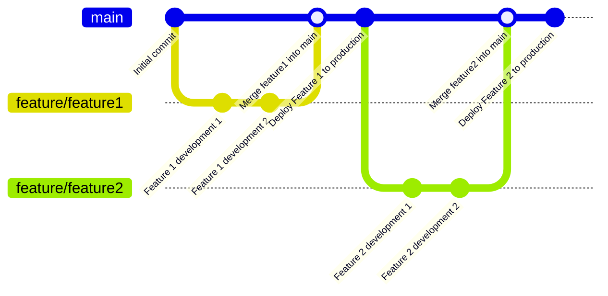
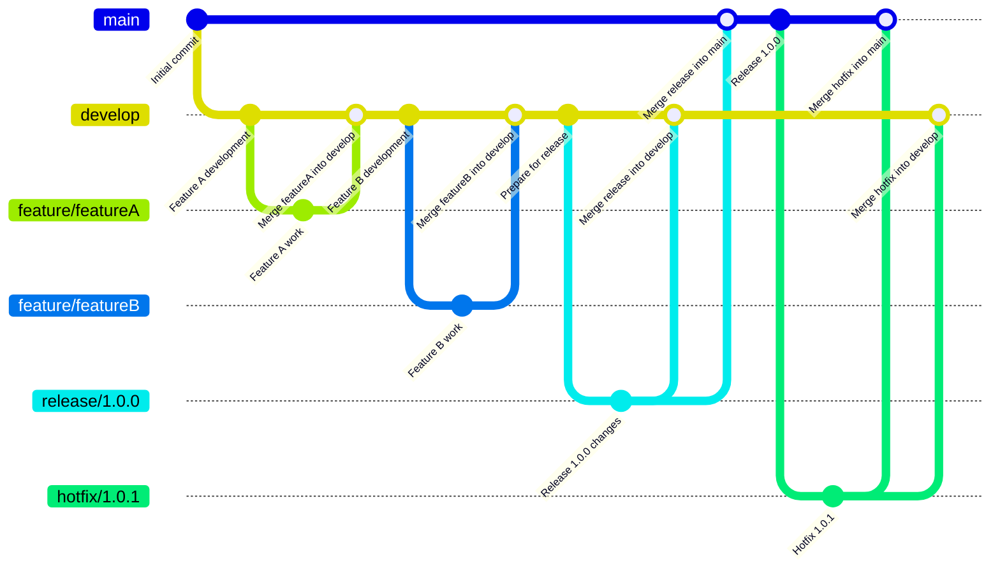

# ブランチ戦略を学ぼう

## 課題1

### Github Flow

```mermaid
gitGraph
   commit id: "Initial commit"
   branch feature/feature1
   checkout feature/feature1
   commit id: "Feature 1 development 1"
   commit id: "Feature 1 development 2"
   checkout main
   merge feature/feature1 id: "Merge feature1 into main"
   commit id: "Deploy Feature 1 to production"
   branch feature/feature2
   checkout feature/feature2
   commit id: "Feature 2 development 1"
   commit id: "Feature 2 development 2"
   checkout main
   merge feature/feature2 id: "Merge feature2 into main"
   commit id: "Deploy Feature 2 to production"

```

### Git Flow

```mermaid
gitGraph
    commit id: "Initial commit"
    branch develop
    checkout develop
    commit id: "Feature A development"
    branch feature/featureA
    checkout feature/featureA
    commit id: "Feature A work"
    checkout develop
    merge feature/featureA id: "Merge featureA into develop"
    commit id: "Feature B development"
    branch feature/featureB
    checkout feature/featureB
    commit id: "Feature B work"
    checkout develop
    merge feature/featureB id: "Merge featureB into develop"
    commit id: "Prepare for release"
    branch release/1.0.0
    checkout release/1.0.0
    commit id: "Release 1.0.0 changes"
    checkout develop
    merge release/1.0.0 id: "Merge release into develop"
    checkout main
    merge release/1.0.0 id: "Merge release into main"
    commit id: "Release 1.0.0"
    branch hotfix/1.0.1
    checkout hotfix/1.0.1
    commit id: "Hotfix 1.0.1"
    checkout main
    merge hotfix/1.0.1 id: "Merge hotfix into main"
    checkout develop
    merge hotfix/1.0.1 id: "Merge hotfix into develop"
```
