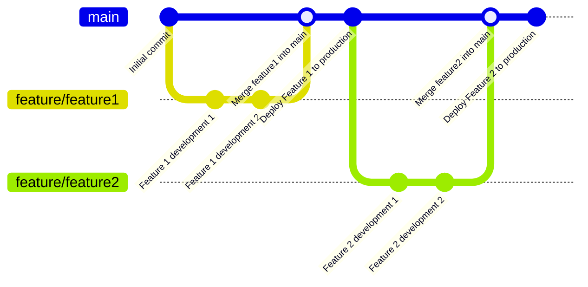
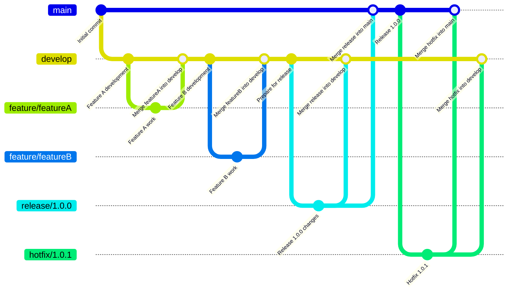

# ブランチ戦略を学ぼう

## 課題1

### Github Flow

**メリット**

- Git Flowと比べて登場するブランチの種類が少なくシンプル。運用もシンプル。

**デメリット**

- 複数のリリースを並行して進めるのには適さない。
- 未完成の機能をデプロイしないようにするために、機能フラグの管理などで手間になる可能性がある。

### Git Flow

**メリット**
- releaseブランチを切って、変更を凍結できるので、テストを安定して行える。
- テストと並行して、developブランチからfeatureブランチを切って次の開発を進められる。

**デメリット**
- Github Flowと比べて登場するブランチの種類が多いので複雑に見える。
- hotfixをdevelopとmainにマージしないといけないのがやや面倒。
- mainブランチの無意味感。リリースタグを追従するだけ

### ブランチベース vs トランクベース
複数機能を同時並行的にリソース効率高く開発したい
→ブランチベース

単機能をすばやくリリースして、仮説検証サイクルを回したい
→トランクベース

## メモ：　トランクベース開発

トランクは、SVNのトランク, Gitのmainブランチなどを指す。
トランクベース開発では、基本的にmainの上で開発。小さいfeatureブランチがあったとしても、すぐにmainにマージされる。

デプロイ頻度が高い = mainブランチが常にデプロイ可能な状態がキープされている。
mainブランチ上で複数の機能が開発されていない。単一機能が開発されている。
即座にリリースできるので、リードタイムの短縮、デプロイ頻度の向上。
複数の機能を同時にリリースすると、複数の仮説検証の内容が混ざる。
細かく一個ずつ機能を開発していくと、精度の高い仮説検証を行えるし、仮説検証のサイクルを素早く回せる。

### フロー効率vsリソース効率
リソース効率: 可能な限りの多くの人が同時並行で働く時間が長い時に、組織としてのパフォーマンスが高いとする。無駄が発生しないように開発計画を立てる。（複数プロジェクトや複数機能の同時並行が発生）
フロー効率: 一つ一つの機能の開発や仮説検証の単位時間内におけるスループットを高める。一つのものに集中してやり切って出し切ることで、リードタイムが短くなる。多くの人が分散していろんなことをやると、調整ごとが増えるし、リソースを集中させることができない。単機能のリリースの方がロールバックが容易。フロー効率を求めると要員にあそびが発生する可能性がある。特にやることが無いみたいな。でも、それで良い。稼働率100%を目指さない。破綻しやすいし、歪みが発生しやすい、バッファがない。うまくworkしない。

PRのコードレビューでボトルネックが発生する。そもそもの設計がおかしかったり、認識の齟齬があると、コードレビューの段階で手戻りが生じる。
レビュワーは往々にして、ベテランのエンジニアが行うが、レビューがどんどん溜まっていく。
コードを書くことで一番価値を提供できるベテランが、レビュー待ちのPRを裁くためにコーディングをやめてレビューに時間を割かないといけない。
レビュー速度を上げるために、一つ一つのレビューに費やす時間を減らす。広く深い指摘ができない。たくさんPRを作ると、そこがボトルネックになる。

### レビューにコストが掛かるなら
ペアプロやモブプロによって常にレビューをしておけば、最終レビューのコストを大幅に下げることができる。何なら、最終レビュー不要になるケースもある。
Githubの登場によって、リソース効率の高い開発が可能になったが、PRやブランチの本数を減らし、ペアプロなどで常時レビューすればフロー効率を高められるのではないか。

### さらにフロー効率を高めるには
全員でmainブランチ上でモブプログラミングを実施する（トランクベース開発）。全員がそこにいるから最終レビューが不要になる。リードタイムが短く、フロー効率が最大な状態になる。
※常にフロー効率を重視すべであるとは限らない。コンシューマが何を求めているか分からないので、高速でMVPを開発してリリースしたいようなケースではフロー効率を重視したい。

競争力のあるソフトウェア製品を仮説検証しながら作っていく時にはフロー効率を求める。
一方、安定的な市場に対しての開発では、フロー効率が重要とは限らない。
