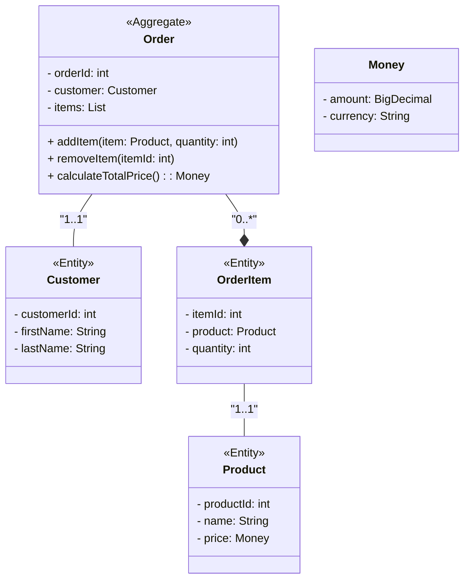
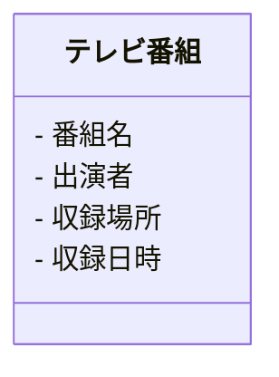
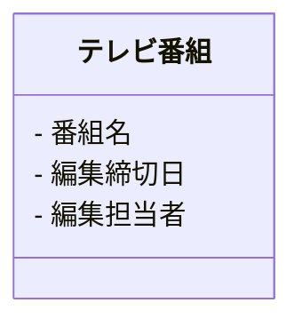
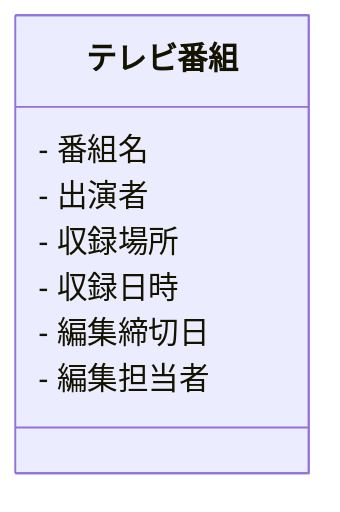

# DDD を学ぶ（基礎）

## 課題１

### エンティティ

ドメインモデルを「モノ」として表現するオブジェクトであり、**識別子**を用いて同一判定を行う。

### 値オブジェクト（バリューオブジェクト）

ドメインモデルを「モノ」として表現するオブジェクトであり、**保持する値**を用いて同一判定を行う。
不変なものとして定義する。

[Entity と値オブジェクトの例](./Entity&ValueObject.ts)

|       特徴       |      Entity      |   Value Object   |
| :--------------: | :--------------: | :--------------: |
|      識別子      |     必ず持つ     |     持たない     |
|      等価性      | 識別子により判定 |  属性により判定  |
| ミュータビリティ | 可変 |       不変       |
|        例        | 顧客、注文、商品 | 金額、住所、日付 |

### 集約

必ず守りたい強い整合性を持ったオブジェクトのまとまりを指す。  
複雑なビジネスロジックを複数のクラスを組み合わせて表現する。

※ 集約について考える際に、データの整合性や永続化については考えないようにする。関心ごとの対象として異なるため。



上記の図は、オンラインショッピングの注文管理を示すドメインモデルの一部を表している。Order は集約であり、Customer、OrderItem、Product はエンティティである。

Order が集約であり、Customer や OrderItem、Product はその一部であることを示している。また、Order から直接的に Customer や OrderItem にアクセスできる一方で、OrderItem や Product 同士の関係は Order を経由してのみアクセスが可能であることを表している。

集約のオブジェクトの親となるオブジェクトを集約ごとに 1 つ決めて、そのオブジェクトを**集約ルート**と呼ぶ。
ここでは、Order が集約ルートとなり、Customer や OrderItem、Product は Order によって一貫して管理・制御されることがわかる。例えば、Order を介してのみ注文アイテムの追加や削除が可能であり、Order が注文アイテムの整合性を保持する役割を果たす。また、Order が注文の合計金額を計算するメソッドを持っていることも、Order が集約としての責任を果たしていることを示している。

集約はドメインモデルにおいて、関連するエンティティを一つの単位として扱い、一貫性を保持しながら管理・制御するための重要な概念である。集約はドメイン駆動設計において、モデルの設計や実装において重要な役割を果たす。また、集約の境界を明確にすることで、ドメインモデルの複雑性を抑え、保守性や拡張性を向上させることができる。

[参考: ドメイン駆動設計の集約のわかりにくさの原因と集約を理解するためのヒント](https://masuda220.hatenablog.com/entry/2021/05/07/142824)

### ユビキタス言語

発見したモデルの言葉を全ての場所で使うという指針。
全ての場所とは、

- 開発者、ビジネス側の人などの職種間でも同じ言葉を使う。
- 会話、ドキュメント、コードなど、どこでも同じ言葉を使う。

認識の齟齬の防止や意味の損失を回避をすることを目的とする。

### 境界づけられたコンテキスト

あるモデルを、同じ意味で使い続ける範囲を定義するもの。
→ モデルを適切な粒度に分割し、精度を上げることを目指す。

境界づけられたコンテキストが無いと、
→ 全てのコンテキストにおいて、同一のモデルが共有される。
→ 一つのモデルが持つべき概念が増えてしまい、そのモデルをクラスに落とし込もうとするとプロパティが過多になってしまう

DDD においては、あるモデルが適用される範囲を明示し、それぞれの中でモデル、言語の統一を目指す。

### ドメイン

ソフトウェアで問題解決しようとする対象領域のこと。
例えば物流システムならば物流業務、会計システムなら経理業務。

### ドメインサービス

モデルをオブジェクトとして表現すると無理があるものをドメインサービスとして表現する。


### リポジトリ

リポジトリは集約単位で DB や外部サービスの API などの永続化層へのアクセスを提供するもの。強い整合性が求められるオブジェクトに関して、ひとまとまりで整合性を確実に保証するために集約単位という制約を設けている。
リポジトリは集約ごとに一つであり、リポジトリに渡すもの、リポジトリから返されるものは、必ず**集約ルートのエンティティ**である  
※リポジトリから直接子オブジェクトを返してはいけないし、子オブジェクト用のリポジトリを別途定義してはいけない。

### アプリケーション（ユースケース）

ドメイン層のクラスが公開しているメソッドを組み合わせて実現する一連の処理。
ドメイン知識をドメイン層で表現することによって、ユースケースクラスには抽象度の高いユースケース記述のような実装が残る。

**イメージ**
ドメイン層でドメイン知識を表現しているため、ドメイン層の処理を並べただけのような記述になる。

<summary>
サンプルコード
<details>
<code>

```typescript
class ResignService {
  constructor(
    // ドメイン層のクラスのみに依存
    private accountRepository: AccountRepository,
    private accountDomainService: AccountDomainService,
    private emailClient: EmailClient,
    private emailAddressConfiguration: EmailAddressConfiguration
  ) {}

  async execute(customerId: string): Promise<void> {
    const account = await this.accountRepository.getByCustomerId(customerId);
    if (!account) {
      throw new Error(`Not found account. customerId: ${customerId}`);
    }

    this.accountDomainService.resign(account);

    const fromAddress = new Email(emailAddressConfiguration.notificationSender);
    const addressConfig = new AddressConfig({
      fromAddress,
      toAddresses: [account.email],
    });

    await this.emailClient.send(addressConfig);
  }
}
```

</code>
</details>
</summary>

### CQS

コマンドクエリ分離原則(Command-Query Separation)。

「オブジェクトのメソッド」をクエリとコマンドという 2 つのカテゴリに分ける。

- あるメソッドがオブジェクトの状態を変更するのなら、そのメソッドは`コマンド`であり、値を戻してはならない。
- あるメソッドが何らかの値を戻すのであれば、そのメソッドは`クエリ`であり、オブジェクトの状態を変えてはならない。

CQS によって、状態を変更するメソッドと変更しないメソッドとを明確に分けて設計することになり、副作用によるリスクを局所化する働きがある。

[参考；CommandQuerySeparation](https://martinfowler.com/bliki/CommandQuerySeparation.html)

### CQRS

コマンド・クエリ責務分離 (Command and Query Responsibility Segregation)。

データストアに対する更新操作を集めたコマンド処理と、読み取り操作（クエリ）を集めたクエリ処理を完全に分離するアーキテクチャパターン。(より具体的には、更新系のクラスと参照系のクラスを分けることを意味する。)

memo

- アプリケーション層：クエリサービスの interface と DTO を定義する。（ドメイン層のモデルとは別に、参照に特化したモデル）
- インフラ層：クエリサービスの実装をする。

| 特徴           | CQS (Command Query Separation)                       | CQRS (Command Query Responsibility Segregation)                                                                                                                              |
| -------------- | ---------------------------------------------------- | ---------------------------------------------------------------------------------------------------------------------------------------------------------------------------- |
| 用途           | コマンド（変更処理）とクエリ（取得処理）を明確に分離 | コマンドとクエリの責務を明確に分離し、異なるモデルを使用する                                                                                                                 |
| コマンドの処理 | 変更を行うコマンドは副作用を持ち、戻り値を持たない   | 変更を行うコマンドは副作用を持ち、戻り値を持たない                                                                                                                           |
| クエリの処理   | 取得を行うクエリは副作用を持たず、戻り値を持つ       | 取得を行うクエリは副作用を持たず、戻り値を持つ                                                                                                                               |
| モデルの設計   | **単一**のモデルでコマンドとクエリを処理する         | **異なる**モデルを使用してコマンドとクエリを処理する                                                                                                                         |                                                                                                                |
| メリット       | 複雑性を低減し、単一責任を持ったクラスを作成できる   | クエリパフォーマンスの向上。複数集約にまたがるデータを取得する際のコードがシンプルになり、保守性の向上が期待できる。複数集約の条件で絞り込んでページングができるようになる。 |
| デメリット     | コマンドとクエリの共有モデルが複雑になる可能性がある | 複数のモデルを管理するための追加の設計とインフラストラクチャが必要                                                                                                           |

### DTO

`Data Transfer Object`の略。
データの集合とその読み書き手段のみからなるシンプルなオブジェクトで、そのデータを利用して行われる具体的な処理（ビジネスロジックなど）は含まない。同じプログラミング言語や実行環境などで動作するプログラム間で、データを効率よく、かつ、互いに利用しやすい形式で受け渡す手段としてよく用いられる。

CQRS の文脈においては、インフラ層に記述されるクエリサービスの実装クラスのメソッドが DTO に詰め替えた形式で戻り値を返す。コントローラーでは DTO からクライアントに応じたクラスへの詰め替えを行う。

[DTO のサンプル](./SearchResultDto.ts)

### ドメインモデル貧血症

ドメインモデルを実装するためのオブジェクトでありながら、ドメイン知識をほとんど持たないオブジェクトのこと。

[ドメインモデル貧血症のサンプル](./anemicDomainModel.ts)

ドメインモデル貧血症に陥ると、

- 保守性が損なわれる
- 不整なインスタンスが生まれる
- アプリケーション層でドメイン知識を表現することになり、ドメイン知識が点在してしまう（仕様の把握が困難になる）

  → ドメインモデル貧血症に陥らないために、ドメインモデルの知識はドメイン層のオブジェクトに持たせるようにする

  - setter を無くし、正しいミューテーションメソッドだけを外部に公開する
  - デフォルトコンストラクタを無くし、意味のある生成メソッドだけが存在するようにさせる。

## 課題２

### 境界づけられたコンテキスト

「テレビ番組」を例に考えます。
企画フェーズと編集フェーズでは、テレビ番組という概念の扱いや、具備すべき情報に違いが生まれます。

**企画フェーズ**においては、テレビ番組は企画に関わる情報を具備しているはずです。
具体的には以下のような情報を持つと考えられます。



**編集フェーズ**においては、テレビ番組を編集対象として捉えており、収録に関わる事（収録日時、収録場所）については関心を持ちません。
逆に「編集締切日」「編集担当者」など、編集フェーズ固有の情報を具備しています。



企画フェーズと編集フェーズを区別せず、一枚岩のテレビ番組モデルを作ってしまうと、モデルがもつべき概念が多岐に渡ってしまい、複雑性を増してしまいます。これを共通のモデルとして適用していくのは辛い。



したがって、コンテキストに応じてモデルを分けて考える必要がある。
