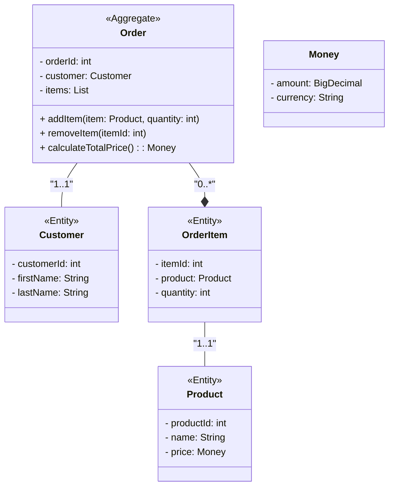

# DDD を学ぶ（基礎）

## 課題１

### エンティティ

### 値オブジェクト（バリューオブジェクト）

### 集約

必ず守りたい強い整合性を持ったオブジェクトのまとまりを指す。  
複雑なビジネスロジックを複数のクラスを組み合わせて表現する。

※ 集約について考える際に、データの整合性や永続化については考えないようにする。関心ごとの対象として異なるため。

上記の図は、オンラインショッピングの注文管理を示すドメインモデルの一部を表している。Order は集約であり、Customer、OrderItem、Product はエンティティである。

Order が集約であり、Customer や OrderItem、Product はその一部であることを示している。また、Order から直接的に Customer や OrderItem にアクセスできる一方で、OrderItem や Product 同士の関係は Order を経由してのみアクセスが可能であることを表している。

これにより、Order が集約ルートとなり、Customer や OrderItem、Product は Order によって一貫して管理・制御されることがわかる。例えば、Order を介してのみ注文アイテムの追加や削除が可能であり、Order が注文アイテムの整合性を保持する役割を果たす。また、Order が注文の合計金額を計算するメソッドを持っていることも、Order が集約としての責任を果たしていることを示している。

集約はドメインモデルにおいて、関連するエンティティを一つの単位として扱い、一貫性を保持しながら管理・制御するための重要な概念である。集約はドメイン駆動設計において、モデルの設計や実装において重要な役割を果たす。また、集約の境界を明確にすることで、ドメインモデルの複雑性を抑え、保守性や拡張性を向上させることができる。

[参考: ドメイン駆動設計の集約のわかりにくさの原因と集約を理解するためのヒント](https://masuda220.hatenablog.com/entry/2021/05/07/142824)

### ユビキタス言語

発見したモデルの言葉を全ての場所で使うという指針。
全ての場所とは、

- 開発者、ビジネス側の人などの職種間でも同じ言葉を使う。
- 会話、ドキュメント、コードなど、どこでも同じ言葉を使う。

認識の齟齬の防止や意味の損失を回避をすることを目的とする。

### 境界づけられたコンテキスト

あるモデルを、同じ意味で使い続ける範囲を定義するもの。
→ モデルを適切な粒度に分割し、精度を上げることを目指す。

// 後で追記する。

### ドメイン

ソフトウェアで問題解決しようとする対象領域のこと。
例えば物流システムならば物流業務、会計システムなら経理業務。

### ドメインサービス

### リポジトリ

### アプリケーション（ユースケース）

### CQS

### CQRS

### DTO

### ドメインモデル貧血症

ドメインモデルを実装するためのオブジェクトでありながら、ドメイン知識をほとんど持たないオブジェクトのこと。  
[ドメインモデル貧血症のサンプル](./anemicDomainModel.ts)

ドメインモデル貧血症に陥ると、

- 不整なインスタンスが生まれる
- アプリケーション層でドメイン知識を表現することになり、ドメイン知識が点在してしまう（仕様の把握が困難になる）

  → ドメインモデル貧血症に陥らないために、ドメインモデルの知識はドメイン層のオブジェクトに持たせるようにする

  - setter を無くし、正しいミューテーションメソッドだけを外部に公開する
  - デフォルトコンストラクタを無くし、意味のある生成メソッドだけが存在するようにさせる。
