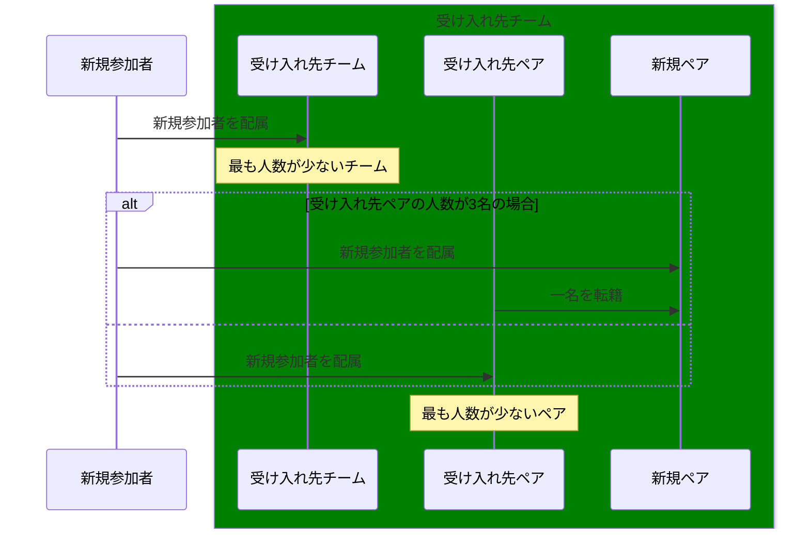

## 新規参加者を登録する

```mermaid
sequenceDiagram
    participant X as 新規参加者
box green 受け入れ先チーム
    participant T as 受け入れ先チーム
    participant P as 受け入れ先ペア
    participant Q as 新規ペア
end

X->>T: 新規参加者を配属
note over T: 最も人数が少ないチーム
alt 受け入れ先ペアの人数が3名の場合
X->>Q: 新規参加者を配属
P->>Q: 一名を転籍
else
X->>P: 新規参加者を配属
end
note over P: 最も人数が少ないペア

```
