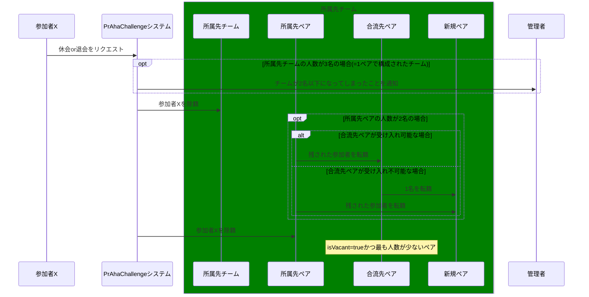
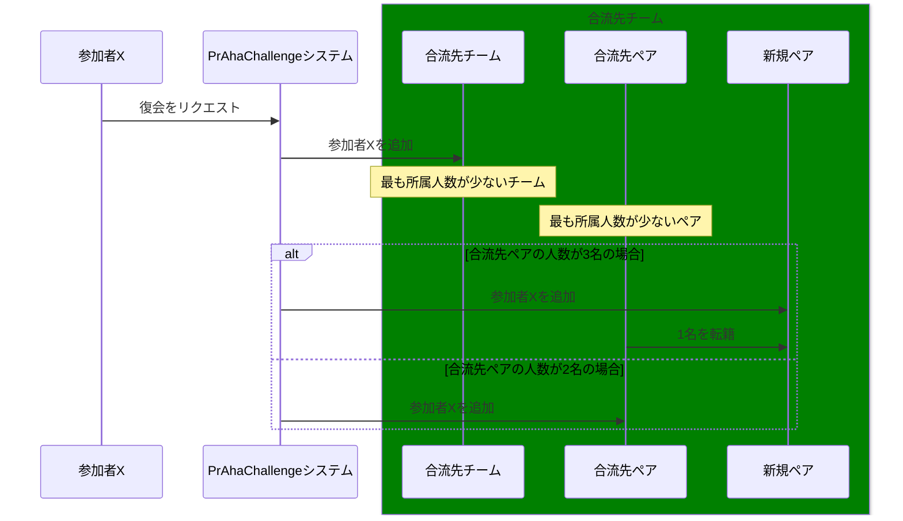

## 参加者の在籍ステータス更新

### 休会 or 退会

```mermaid
sequenceDiagram
    participant X as 参加者X
    participant S as PrAhaChallengeシステム
    box Green 所属先チーム
    participant T as 所属先チーム
    participant P as 所属先ペア
    participant Q as 合流先ペア
    participant N as 新規ペア
    end
    participant A as 管理者

    X->>S: 休会or退会をリクエスト
    opt 所属先チームの人数が3名の場合(=1ペアで構成されたチーム)
    S->>A: チームが2名以下になってしまったことを通知
    end
    S->>T: 参加者Xを除籍

    opt 所属先ペアの人数が2名の場合
        alt 合流先ペアが受け入れ可能な場合
            P->>Q: 残された参加者を転籍
        else 合流先ペアが受け入れ不可能な場合
            Q->>N: 1名を転籍
            P->>N: 残された参加者を転籍
        end
    end
    S->>P: 参加者Xを除籍

    note over Q: isVacant=trueかつ最も人数が少ないペア
```

### 復会

```mermaid
sequenceDiagram
    participant X as 参加者X
    participant S as PrAhaChallengeシステム
    box Green 合流先チーム
    participant T as 合流先チーム
    participant P as 合流先ペア
    participant Q as 新規ペア
    end

    X->>S: 復会をリクエスト
    S->>T: 参加者Xを追加
    note over T: 最も所属人数が少ないチーム
    note over P: 最も所属人数が少ないペア
    alt 合流先ペアの人数が3名の場合
    S->>Q: 参加者Xを追加
    P->>Q: 1名を転籍
    else 合流先ペアの人数が2名の場合
    S->>P: 参加者Xを追加
    end

```
