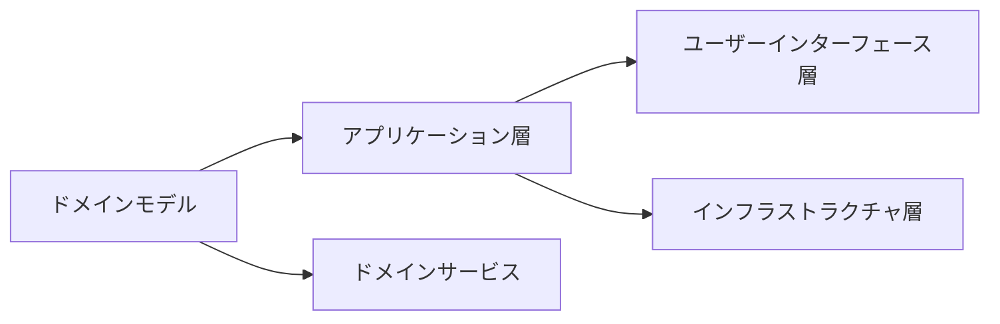
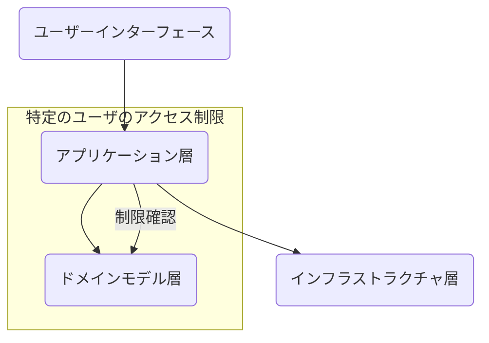

# オニオンアーキテクチャを学ぶ

## 課題１

### オニオンアーキテクチャを図解

オニオンアーキテクチャは、ソフトウェアのアーキテクチャの一種であり、内側から外側に向かって複数のレイヤーを重ねることで、アプリケーションを分離している設計パターンです。このアーキテクチャは、依存関係の逆転原則（DIP）とインターフェース分離原則（ISP）に基づいています。

最も内側のレイヤーは、ドメインモデルです。このレイヤーには、アプリケーションのビジネスロジックが含まれます。

   ドメインサービスは、ドメインモデルを使用してビジネスロジックを実行します。
   
   インフラストラクチャレイヤーは、データベース、外部 API、ログなど、アプリケーションの周辺に位置するコンポーネントを扱います。

 ユーザーインターフェースは、アプリケーションとユーザーの間のやり取りを処理し、UI や Web API などの外部インターフェースを提供します。
 
 このように、オニオンアーキテクチャでは、各レイヤーが役割を分担し、疎結合であるため、アプリケーションの拡張や保守が容易になります。

### ドメインモデル層が他のどの層にも依存していないことのメリット

中心に位置するドメインモデル層は、他の層に依存していないため、アプリケーションのビジネスロジックを独立して開発することができる。これにより、以下のようなメリットがある。

**1. ビジネスロジックの再利用性が高まる**
ドメインモデル層には、アプリケーションのビジネスロジックが含まれています。この層を独立して開発することで、ビジネスロジックを再利用しやすくなります。たとえば、異なるインフラストラクチャ層に対応する複数のアプリケーションがある場合、共通のビジネスロジックをドメインモデル層で実装することで、ビジネスロジックの重複を回避できます。

**2. アプリケーションの拡張性が高まる**
ドメインモデル層が他の層に依存していないため、アプリケーションの拡張が容易になります。たとえば、新しいデータベースを導入する場合、インフラストラクチャ層を置き換えるだけで済みます。ドメインモデル層の変更は必要ありません。

**3. アプリケーションのテスト性が高まる**

ドメインモデル層が独立しているため、単体テストや統合テストが容易になります。ビジネスロジックを含むドメインモデル層をテストすることで、アプリケーションの正確性を検証できます。また、ドメインモデル層を独立してテストすることで、インフラストラクチャ層に問題があっても、テストが続行できる可能性が高くなります。

### 層を跨いだ依存が発生する時にインターフェースへの依存を許可する意義

層をまたいで依存関係が発生する場合は、その依存関係を抽象化するためにインターフェースに対する依存のみを許可するように設計する。

これには以下のようなメリットがある。

**アプリケーションの変更に対する影響範囲が限定できる**

依存関係をインターフェースに対する依存のみに限定することで、アプリケーションの変更に対する影響範囲を限定できます。たとえば、インフラストラクチャ層で使用しているライブラリやフレームワークが変更された場合、その影響を受けるのはインフラストラクチャ層の実装のみとなります。ドメインモデル層など、他の層のコンポーネントは影響を受けずに変更が行えるため、アプリケーション全体の開発プロセスがスムーズに進みます。

**単体テストが容易になる**

インターフェースに対する依存のみを許可することで、単体テストをより簡単に実行できます。インターフェースは、実際の実装に依存せず、抽象的なインターフェースのみをテストできるためです。このように、インターフェースに依存することで、単体テストの作成が容易になります。

**柔軟性が高まる**

インターフェースに依存することで、異なる実装を交換することが可能になります。たとえば、インフラストラクチャ層で使用しているデータベースを変更する場合、データベースに依存するコードはインターフェースに依存するだけであるため、簡単に交換することができます。このように、インターフェースに依存することで、柔軟性が高まります。

### 依存性の逆転がオニオンアーキテクチャにおいてどのように利用されているか

リポジトリパターンで依存性の逆転が用いられていると思います。

**ドメイン層**

インフラ層で実装するクラスのインターフェースを定義。  
永続化のための手段についての知識を持たない。

**インフラ層**

ドメイン層で定義したインターフェースを実装する。  
永続化のための知識はインフラ層内にとどめる。

このようにすることによって、外部との通信の手段が変わったとしてもドメイン層は影響を受けず、インフラ層のみに影響範囲をとどめることができる。

参考：[DDDを実践するための手引き（リポジトリパターン編）](https://zenn.dev/kohii/articles/e4f325ed011db8#%E4%BE%9D%E5%AD%98%E6%80%A7%E9%80%86%E8%BB%A2%E3%81%AE%E5%8E%9F%E5%89%87-%EF%BC%88dependency-inversion-principle%EF%BC%89)

### アクセス制限機能

アプリケーション層がドメインモデル層とインフラストラクチャ層の間の仲介役となる。したがって、アクセス制限機能を実装するのは、アプリケーション層になります。

具体的には、アプリケーション層に特定のユーザに対するアクセス制限を確認するためのコードを記述します。このコードは、ドメインモデル層のオブジェクトに対してアクセスする前に呼び出され、特定のユーザがリソースにアクセスできるかどうかを判断します。アクセス制限機能は、インフラストラクチャ層に依存することなく実装する必要があります。したがって、具体的な実装に応じて、アプリケーション層内に専用のクラスやメソッドを用意する必要があるかもしれない。

図の中で、アプリケーション層がドメインモデル層とインフラストラクチャ層の間の仲介役となっています。そして、特定のユーザに対するアクセス制限は、アプリケーション層に実装されます。アプリケーション層内で、制限確認のための専用のクラスやメソッドを用意することができます。制限確認の結果に応じて、ドメインモデル層のオブジェクトにアクセスするかどうかを決定します。

### DBをMySQLからPostgreSQLに変更した場合

オニオンアーキテクチャでは、データベースを扱う層はインフラストラクチャ層に位置しています。したがって、データベースをMySQLからPostgreSQLに変更する場合は、インフラストラクチャ層のコードを修正する必要があります。具体的には、SQLクエリの文法などを修正する必要があります。

### オニオンアーキテクチャクイズ

**質問1**

オニオンアーキテクチャを採用すべきではないケースはどのようなものがあるか？

解答

思い浮かばなかったのでchatgptに聞いてみました。
> オニオンアーキテクチャは、アプリケーションの保守性や拡張性を高めることができるため、多くの場合有効な選択肢となります。しかし、以下のようなケースでは、オニオンアーキテクチャの採用を避けることが適切かもしれません。  
小規模なアプリケーション：オニオンアーキテクチャは、大規模なアプリケーションに適しています。小規模なアプリケーションでは、過度に複雑になる可能性があるため、オーバーエンジニアリングになってしまう可能性があります。  
業務システム開発において基幹業務の場合：オニオンアーキテクチャは、開発期間を長くする代わりに、保守性や拡張性を高めることができます。しかし、基幹業務システムのように緊急性の高い開発期間を要する場合には、オニオンアーキテクチャは適していないかもしれません。  
技術的なスキルが不足している場合：オニオンアーキテクチャを採用するためには、開発チームに一定の技術的なスキルが必要です。特に、依存性の注入などの概念が理解できていない場合、採用は困難かもしれません。  
以上のようなケースでは、オニオンアーキテクチャの採用を避けることが適切である可能性があります。

**質問2**

オニオンアーキテクチャの名前の由来は？

解答

オニオンアーキテクチャという名前は、外側の層が内側の層を覆っているため、玉ねぎに似ていることからきています。
また、ドメインモデルが中心にあるため、ドメインモデルを「核」とするアーキテクチャになっていることも関係しています。

