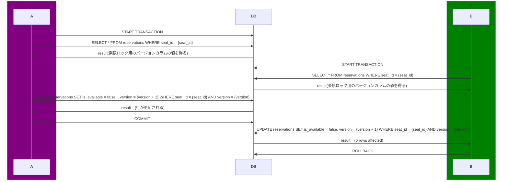
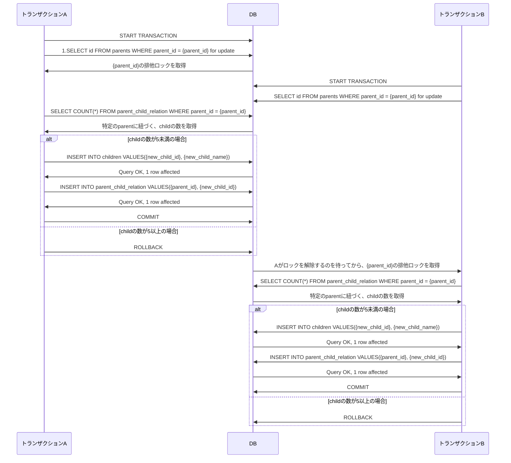
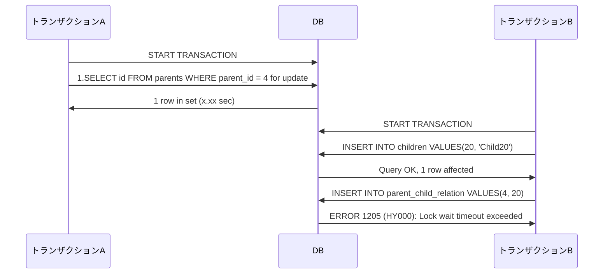

### 課題 1

> デッドロックの説明

デッドロックとは、複数のトランザクションが、互いに相手が所有するロックが解放されるのを待機して処理が進まなくなってしまう状態。共有ロック・排他ロックが両方使われる場合と、排他ロックが複数使われる場合に発生する。

変換デッドロックとサイクルデッドロックの 2 種類のデッドロックが存在する。

**変換デッドロック**

```sql
mysql(A)> begin;
Query OK, 0 rows affected (0.00 sec)

mysql(A)> select * from numbers where id = 1 for share;
+----+-------+
| id | value |
+----+-------+
|  1 |    30 |
+----+-------+
1 row in set (0.00 sec)

mysql(B)> begin;
Query OK, 0 rows affected (0.00 sec)

mysql(B)> select * from numbers where id = 1 for share;
+----+-------+
| id | value |
+----+-------+
|  1 |    30 |
+----+-------+
1 row in set (0.00 sec)

-- ロック待ちになり、 相手がデッドロックでロールバックされてから実行される
mysql(A)> update numbers set value = 100 where id = 1;
Query OK, 1 row affected (4.34 sec)
Rows matched: 1  Changed: 1  Warnings: 0

mysql(B)> update numbers set value = 100 where id = 1;
ERROR 1213 (40001): Deadlock found when trying to get lock; try restarting transaction
```

**サイクルデッドロック**

```sql
mysql(A)> begin;
Query OK, 0 rows affected (0.00 sec)

mysql(B)> begin;
Query OK, 0 rows affected (0.00 sec)

mysql(A)> select * from numbers where id = 1 for update;
+----+-------+
| id | value |
+----+-------+
|  1 |    30 |
+----+-------+
1 row in set (0.02 sec)

mysql(B)> select * from numbers where id = 2 for update;
+----+-------+
| id | value |
+----+-------+
|  2 |    10 |
+----+-------+
1 row in set (0.00 sec)

mysql(A)> select * from numbers where id = 2 for update;
-- ロック待ちになり、Bがデッドロックでロールバックされてから表示される
+----+-------+
| id | value |
+----+-------+
|  2 |    10 |
+----+-------+
1 row in set (6.82 sec)

mysql(B)> select * from numbers where id = 1 for update;
ERROR 1213 (40001): Deadlock found when trying to get lock; try restarting transaction
```

> デッドロックの事例

```sql
CREATE TABLE products (
  id INT NOT NULL PRIMARY KEY AUTO_INCREMENT,
  name VARCHAR(191) NOT NULL
);

-- 在庫
CREATE TABLE inventories (
  id INT NOT NULL PRIMARY KEY AUTO_INCREMENT,
  product_id INT NOT NULL,
  current_quantity INT NOT NULL,

  FOREIGN KEY (product_id) REFERENCES products(id) ON DELETE RESTRICT ON UPDATE CASCADE----重要
);

-- 入荷
CREATE TABLE arrivals (
  id INT NOT NULL PRIMARY KEY AUTO_INCREMENT,
  inventory_id INT NOT NULL,
  quantity INT NOT NULL,
  arrived_at DATETIME NOT NULL DEFAULT CURRENT_TIMESTAMP,

  FOREIGN KEY (inventory_id) REFERENCES inventories(id) ON DELETE RESTRICT ON UPDATE CASCADE----重要
);
```

入荷があるごとに入荷レコードを登録し、関連する在庫の在庫数を更新するシステム。

```sql
-- T1で入荷を登録
mysql(T1)> begin;
Query OK, 0 rows affected (0.00 sec)

mysql(T1)> insert into arrivals (inventory_id, quantity) values (1, 10);
Query OK, 1 row affected (0.04 sec)

-- T2で入荷を登録
mysql(T2)> begin;
Query OK, 0 rows affected (0.00 sec)

mysql(T2)> insert into arrivals (inventory_id, quantity) values (1, 20);
Query OK, 1 row affected (0.02 sec)

--- T1で在庫を更新しようとすると、ロック待ちになる
mysql(T1)> update inventories set current_quantity = current_quantity + 10 where id = 1;

---T2でも在庫を更新すると、デッドロックになる
mysql(T2)> update inventories set current_quantity = current_quantity + 20 where id = 1;
ERROR 1213 (40001): Deadlock found when trying to get lock; try restarting transaction
```

デッドロックが発生したのは、共有ロックがかかったデータに、2 つのトランザクションから排他ロックを取得しようとしたため。
なぜ共有ロックが取得されるか  
→ 入荷に INSERT するときに、外部キーで参照する在庫レコードに共有ロックが設定されるから

> FOREIGN KEY 制約がテーブル上で定義されている場合は、制約条件をチェックする必要がある挿入、更新、または削除が行われると、制約をチェックするために、参照されるレコード上に共有レコードレベルロックが設定されます。
> [MySQL :: MySQL 8.0 リファレンスマニュアル :: 15.7.3 InnoDB のさまざまな SQL ステートメントで設定されたロック](https://dev.mysql.com/doc/refman/8.0/ja/innodb-locks-set.html)

対策  
→ 共有ロックが取得される前に、排他ロックを取得する。

```sql
begin;
-- 最初に排他ロックを取得する
select id from inventories where id = {inventory_id} for update;
-- 排他ロックを取得しているため、ここで共有ロックは取得されない
insert arrivals (inventory_id, quantity) values ({inventory_id}, {quantity});
update inventories set current_quantity = current_quantity - quantity;
commit;
```

> ISOLATION LEVEL

トランザクション分離レベルは、データベースシステムにおいて複数のトランザクションが同時に実行される場合に、それらのトランザクションがどの程度相互に影響を及ぼすかを定義する概念である。

- 以下は一般的なトランザクション分離レベル（※特定の DBMS の分離レベルではない！）
  - InnoDB のデフォルト分離レベルは、REPEATABLE READ
  - InnoDB では、例外的に REPEATABLE READ でもファントムリードが生じない。

| Isolation Level | Dirty Read | Fuzzy read | Phantom read |
| --------------- | ---------- | ---------- | ------------ |
| READ UNCOMMITED | 恐れあり   | 恐れあり   | 恐れあり     |
| READ COMMITED   | 発生しない | 恐れあり   | 恐れあり     |
| REPEATABLE READ | 発生しない | 発生しない | 恐れあり     |
| SERIALIZABLE    | 発生しない | 発生しない | 発生しない   |

> 行レベルのロック、テーブルレベルのロックの違い

| ロックの種類       | 概要                               | 備考 |
| ------------------ | ---------------------------------- | ---- |
| 行ロック           | ある特定の 1 行のみをロックする    |      |
| テーブルロック     | ある特定のテーブル全体をロックする |      |
| データベースロック | データベース全体をロックする       |      |

- MySQL における行ロックとテーブルロック
  - 行ロックのメリット
    - 異なるセッションが異なる行にアクセスする場合、ロックの競合が少なくなる
    - ロールバックする変更が少なくなる
    - 1 つの行を長時間ロックできる
  - テーブルロックのメリット
    - 必要なメモリが比較的少なくなる
    - 単一のロックだけが必要なため、テーブルの大部分に対して使用する場合には高速
    - データの大部分に対して GROUP BY を頻繁に実行する場合や、テーブル全体を頻繁にスキャンする必要がある場合に高速

> 悲観ロックと楽観ロックの違い

| ロック方法 | 概要                                                                                                                                                                                                                                                                                             |
| ---------- | ------------------------------------------------------------------------------------------------------------------------------------------------------------------------------------------------------------------------------------------------------------------------------------------------ |
| 楽観ロック | データそのものはロックせず、更新対象のデータがデータ取得時と同じ状態であることを確認してから更新することで、データの整合性を保証する方式。その確認のために、Version を管理するためのカラムをもうけて（ロックキーと呼ばれる）、データ取得時の Version とデータ更新時の Version を比較する。       |
| 悲観ロック | 更新対象のデータを取得する前にロックをかけることで、他のトランザクションから更新されないようにする方式。トランザクション開始直後に更新対象となるレコードのロックを取得する。ロックされたレコードはトランザクションがコミットまたはロールバックされるまで、データの整合性を保証することができる。 |

> 共有ロックと排他ロックの違い

| ロックの厳しさ           | 概要                                                                 | 備考                                                                  |
| ------------------------ | -------------------------------------------------------------------- | --------------------------------------------------------------------- |
| 共有ロック               | 他のトランザクションからのデータの参照は可能だが、更新は不可能。<br> | 通常、SELECT 文で選択した行には自動的に共有ロックがかかる。           |
| 排他ロック（占有ロック） | 他のトランザクションからのデータの参照も更新も不可能。               | `SELECT~FOR UPDATE（NOWAIT）`文を実行する場合は、排他ロックがかかる。 |

> fuzzy-read と phantom-read の違い

**fuzzy-read**
トランザクション A でデータを複数回読み取っている途中で、トランザクション B でデータを更新してコミットした場合、トランザクション A で違う結果のデータを読み取ってしまう問題が起きる

1. トランザクション A でレコードを SELECT する。① となっている。
1. トランザクション B でレコードを ① から ② に UPDATE し、COMMIT する。
1. トランザクション A で同じレコードを再度 SELECT する。② となっている。

**phantom-read**
トランザクション A で一定の範囲のレコードに対して処理を行っている途中で、トランザクション B でデータを追加・削除してコミットした場合、トランザクション A で幻影のようにデータが反映されるため、処理の結果が変わってしまう問題が起きる。

1. トランザクション A でレコードを SELECT する。該当レコードがない。
1. トランザクション B でレコードを INSERT し、COMMIT する。
1. トランザクション A でレコードを SELECT する。2 で INSERT としたレコードが取得できる。

### 課題 2

**Dirty Read**

```sql
mysql1> SET SESSION TRANSACTION ISOLATION LEVEL READ UNCOMMITTED;
mysql2> SET SESSION TRANSACTION ISOLATION LEVEL READ UNCOMMITTED;

mysql1> select * from demo;
+----+-----+
| id | num |
+----+-----+
|  1 |  10 |
|  2 |  20 |
|  3 |  30 |
|  4 |  40 |
+----+-----+
4 rows in set (0.01 sec)

mysql1> begin;
Query OK, 0 rows affected (0.00 sec)

mysql2> begin;
Query OK, 0 rows affected (0.00 sec)

mysql1> insert into demo values(5,50);
Query OK, 1 row affected (0.01 sec)

--Dirty Read発生
mysql2> select * from demo;
+----+-----+
| id | num |
+----+-----+
|  1 |  10 |
|  2 |  20 |
|  3 |  30 |
|  4 |  40 |
|  5 |  50 |
+----+-----+
5 rows in set (0.01 sec)
```

**Fuzzy Read**

```sql
mysql1> SET SESSION TRANSACTION ISOLATION LEVEL READ COMMITTED;
Query OK, 0 rows affected (0.01 sec)

mysql2> SET SESSION TRANSACTION ISOLATION LEVEL READ COMMITTED;
Query OK, 0 rows affected (0.01 sec)

mysql1> begin;
Query OK, 0 rows affected (0.01 sec)

mysql2> begin;
Query OK, 0 rows affected (0.01 sec)

mysql1> select * from demo;
+----+-----+
| id | num |
+----+-----+
|  1 |  10 |
|  2 |  20 |
|  3 |  30 |
|  4 |  40 |
+----+-----+
4 rows in set (0.01 sec)

mysql2> select * from demo;
+----+-----+
| id | num |
+----+-----+
|  1 |  10 |
|  2 |  20 |
|  3 |  30 |
|  4 |  40 |
+----+-----+
4 rows in set (0.01 sec)

mysql1> update demo set num = 41 where id = 4;
Query OK, 1 row affected (0.02 sec)
Rows matched: 1  Changed: 1  Warnings: 0

mysql1> commit;
Query OK, 0 rows affected (0.02 sec)

--Fuzzy Read発生
mysql2> select * from demo where id = 4;
+----+-----+
| id | num |
+----+-----+
|  4 |  41 |
+----+-----+
1 row in set (0.01 sec)

```

**Phantom Read**

```sql
mysql1> SET SESSION TRANSACTION ISOLATION LEVEL READ COMMITTED;
Query OK, 0 rows affected (0.01 sec)

mysql2> SET SESSION TRANSACTION ISOLATION LEVEL READ COMMITTED;
Query OK, 0 rows affected (0.01 sec)

mysql1> begin;
Query OK, 0 rows affected (0.01 sec)

mysql2> begin;
Query OK, 0 rows affected (0.01 sec)

mysql1> select * from demo;
+----+-----+
| id | num |
+----+-----+
|  1 |  10 |
|  2 |  20 |
|  3 |  30 |
|  4 |  41 |
+----+-----+
4 rows in set (0.01 sec)

mysql2> select * from demo;
+----+-----+
| id | num |
+----+-----+
|  1 |  10 |
|  2 |  20 |
|  3 |  30 |
|  4 |  41 |
+----+-----+
4 rows in set (0.01 sec)

mysql1> insert into demo values(5,50);
Query OK, 1 row affected (0.01 sec)

mysql1> delete from demo where id = 4;
Query OK, 1 row affected (0.01 sec)

mysql1> commit;
Query OK, 0 rows affected (0.03 sec)

--Phantom Read発生
mysql2> select * from demo;
+----+-----+
| id | num |
+----+-----+
|  1 |  10 |
|  2 |  20 |
|  3 |  30 |
|  5 |  50 |
+----+-----+
4 rows in set (0.01 sec)

```

> 映画チケット販売システム、楽観ロック or 悲観ロック

- 競合の可能性が限りなく低い
- 悲観ロックだと、ロックを取得したレコードの読み取りさえもできない

上記 2 点から、楽観ロックで良いと思った。

[参考: Optimistic vs. Pessimistic locking](https://stackoverflow.com/questions/129329/optimistic-vs-pessimistic-locking)

映画館の予約システムにおける楽観ロック



**food for thought**

以下の順番で処理を行うべきだと考える。

1. 自分たちが管理している DB への操作
1. 外部 API を用いた決済処理

この順番にすることで、外部 API を用いた決済処理が失敗した場合に、自分たちが管理している DB に対してはロールバックが可能なので、完全な決済前の状態を保つことが比較的容易であると考えられる。

Air Table に掲載されている擬似コードだと、

1. 外部 API を用いた決済処理
1. 自分たちが管理している DB への操作

という順番になっているが、

- 外部 API を用いた決済は成功している
- 競合により OptimisticLockException が発生して DB への UPDATE 文が失敗した

という状況が生まれうる。

→ 購入は成立すべきではないのに、外部 API によって決済が完了してしまっている。  
→ 外部 API をもちいた決済なので、決済キャンセルのエンドポイントがない場合ロールバックができない。  
→ 決済キャンセルのエンドポイントが存在したとしても、決済キャンセルのエンドポイントへのリクエストが失敗する可能性もある。

### 1 Parent With Less Than 5 Children

テーブル

```sql
mysql> describe parents;
+-------+--------------+------+-----+---------+-------+
| Field | Type         | Null | Key | Default | Extra |
+-------+--------------+------+-----+---------+-------+
| id    | int          | NO   | PRI | NULL    |       |
| name  | varchar(255) | NO   |     | NULL    |       |
+-------+--------------+------+-----+---------+-------+
2 rows in set (0.20 sec)

mysql> describe children;
+-------+--------------+------+-----+---------+-------+
| Field | Type         | Null | Key | Default | Extra |
+-------+--------------+------+-----+---------+-------+
| id    | int          | NO   | PRI | NULL    |       |
| name  | varchar(255) | NO   |     | NULL    |       |
+-------+--------------+------+-----+---------+-------+
2 rows in set (0.02 sec)

mysql> describe parent_child_relation;
+-----------+------+------+-----+---------+-------+
| Field     | Type | Null | Key | Default | Extra |
+-----------+------+------+-----+---------+-------+
| parent_id | int  | NO   | PRI | NULL    |       |
| child_id  | int  | NO   | PRI | NULL    |       |
+-----------+------+------+-----+---------+-------+
2 rows in set (0.02 sec)
```



- 親の行の排他ロックを取得する
- 排他ロックが取得できた場合のみ、child の生成と parent と child の紐付けを行う

このようにすれば、1parent につき 5 以下の children というルールが守られると考えられる。

※テーブル全体をロックするのも考えたが、一つのトランザクションしかテーブル操作ができないため、パフォーマンスの劣化が予想される。

### 課題 3

## クイズ 1

- PostgreSQL における「current_timestamp」と「clock_timestamp」の違いは何でしょうか？

<details><summary>想定回答</summary>

`current_timestamp`はトランザクションの開始日時を表す。(`now`や`current_date`も同様)

```sql
testdb1=> begin;
BEGIN
testdb1=> select current_timestamp;
current_timestamp
-------------------------------
2019-09-22 20:05:26.231047+09 ← 現在日時を表示
(1 row)
testdb1=> select current_timestamp; ← 数秒待ってから実行
2019-09-22 20:05:26.231047+09 ← 数秒待ったのに変わってない！
(1 row)
testdb1=> commit; ← トランザクションを終了
COMMIT;
testdb1=> select current_timestamp; ← もう一度現在日時を表示
current_timestamp
-------------------------------
2019-09-22 20:07:59.674137+09 ← 変わるようになった
(1 row)
```

一方、`clock_timestamp()`を用いることによって、トランザクション内でも本当の現在日時を取得できるようになる。

</details>

## クイズ 2

```sql
CREATE TABLE parents (
    id INT NOT NULL,
    name VARCHAR(255) NOT NULL,
    PRIMARY KEY (id)
);

CREATE TABLE children (
    id INT NOT NULL,
    name VARCHAR(255) NOT NULL,
    PRIMARY KEY (id)
);

CREATE TABLE parent_child_relation (
    parent_id INT NOT NULL,
    child_id INT NOT NULL,
    PRIMARY KEY (parent_id, child_id),
    FOREIGN KEY (parent_id) REFERENCES parents(id),
    FOREIGN KEY (child_id) REFERENCES children(id)
);
```

上記のテーブルを想定する。
以下のようなケースを考える。



なぜトランザクション B が`parent_child_relation`テーブルにインサートした時にエラーが発生したのでしょうか？
（DBMS は MySQL を想定）

<details><summary>想定回答</summary>

トランザクション B が`parent_child_relation`テーブルに新たな行を INSERT する。

その新たな行は、`parents`テーブルの id を外部キーとして参照しているため、参照先である `parents` テーブルの id = 4 の行の共有ロックを取得しようとする。

しかし、`parents`テーブルの id = 4 の行はトランザクション A が排他ロックを取得しているため、トランザクション B はロックの解除待ちになる。

トランザクション A はロックの解除をしていないため、トランザクション B でタイムアウトエラーが発生する。

参考
[外部キー制約の親子テーブルにおいて共有ロックからの deadlock](https://kawabatas.hatenablog.com/entry/2020/06/21/160615)

</details>

### クイズ 3

なぜデッドロックになるのでしょうか？

```sql
 mysql> CREATE TABLE demo (
    id bigint(20) unsigned NOT NULL AUTO_INCREMENT,
    num bigint(20) unsigned NOT NULL,
    PRIMARY KEY(id)
 );


 mysql> INSERT INTO demo (id, num) VALUES (1, 10), (2, 20), (3, 30), (4, 40);

 mysql> select * from demo;
+----+-----+
| id | num |
+----+-----+
|  1 |  10 |
|  2 |  20 |
|  3 |  30 |
|  4 |  40 |
+----+-----+
4 rows in set (0.01 sec)

  -- トランザクションA
 mysql> BEGIN;
 mysql> DELETE FROM demo WHERE id= 8;

  -- トランザクションB
 mysql> BEGIN;
 mysql> DELETE FROM demo WHERE id = 9;

  -- トランザクションA
 mysql> INSERT INTO demo VALUES (8, 80);
(待たされる。トランザクションBがERRORになった後→) Query OK, 1 row affected (4.46 sec)

  -- トランザクションB
 mysql> INSERT INTO demo VALUES (9, 90);
 ERROR 1213 (40001): Deadlock found when trying to get lock; try restarting transaction

```

<details><summary>想定回答</summary>

- トランザクション A の`DELETE FROM demo WHERE id= 8`によって、id が`4~∞`に対してギャップロックが取得される。
- トランザクション B の`DELETE FROM demo WHERE id= 9`によって、id が`4~∞`に対してギャップロックが取得される。

`INSERT INTO demo VALUES (8, 80)`によって、トランザクション A は id = 8 のレコードロックを取得しに行くが、トランザクション B によってギャップロックが取得されているため、ロックの解除待ちになる。  
`INSERT INTO demo VALUES (9, 90)`によって、トランザクション B は id = 9 のレコードロックを取得しに行くが、トランザクション A によってギャップロックが取得されているため、ロックの解除待ちになる。  
→ デッドロック発生

参考

- [ネクストキーロックとは](https://softwarenote.info/p1067/)
- [mysql のネクストキーロックと挿入インテンションギャップロックのデッドロックを確認する](https://zudoh.com/?p=356)

</details>
